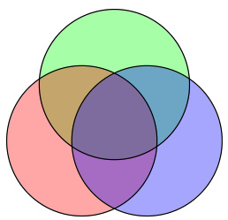

# Kapitel 2

## Wahrscheinlichkeitstheorie und randomisierte Algorithmen

Über die Jahre haben stochastische Konzepte in der Informatik eine wachsende Bedeutung gewonnen. Einige (algorithmische) Beispiele wurden im ersten Teil der Vorlesung bereits aufgegriffen. Die Grundlagen des Hashings beruhen beispielsweise auf Aussagen über die Verteilung bestimmter Ereignisse. Auch dass der Sortieralgorithmus QuickSort zu Recht das Wort „schnell“ in seinem Namen trägt (und nicht etwa „SlowSort“ genannt wird, was in Anbetracht seiner WorstCase Laufzeit von $\Omega (  { n } ^ { 2 } )$ auf den ersten Blick durchaus angebracht scheint), verdankt er seiner sehr effizienten Performance bei einer zufälligen Wahl der Pivotelemente.

Der Einfluss der Stochastik auf die Informatik geht aber weit über die Algorithmik hinaus. Jegliche Art von Kryptographie, wie wir sie heutzutage in vielen Bereichen des täglichen Lebens verwenden, wäre ohne Stochastik so nicht möglich. Aber beim sogenannten verteilten Rechnen oder auch bei der Entwicklung von Verfahren für Roboter, die sich eigenständig koordinieren sollen, spielt der Zufall eine grosse Rolle.

In diesem Kapitel werden wir die Grundlagen der Stochastik entwickeln und an Beispielen illustrieren.

## 2.1 Grundbegriffe und Notationen

Einem stochastischen Experiment liegt immer ein Wahrscheinlichkeitsraum (eine Menge $\Omega$) zugrunde, zusammen mit Wahrscheinlichkeiten für die Elemente dieser Menge. Die folgende Definition formalisiert dies.

::: definition Definition 2.1.{#definition-2-1}

Ein diskreter **Wahrscheinlichkeitsraum** ist bestimmt durch 
eine **Ergebnismenge**&nbsp;$\Omega = \{ \omega_1 , \omega _ { 2 } , . . . \}$ von **Elementarereignissen**.

Jedem Elementarereignis $\omega _ { i }$ ist eine **(Elementar-)Wahrscheinlichkeit** $\Pr [ \omega _ { i } ]$ zugeordnet, wobei wir fordern, dass $0 \leq \Pr [ \omega _ { i } ] \leq$ 1 und

$
\displaystyle\sum _ { \omega \in \Omega } \Pr [ \omega ] = 1 .
$

Eine Menge $X \subseteq \Omega$ heisst Ereignis. Die Wahrscheinlichkeit $\operatorname*{Pr}[X]$ eines Ereignisses ist definiert durch

$
\Pr [X] : = \displaystyle\sum _ { \omega \in X } \Pr [ \omega ] .
$

Ist $X$ ein Ereignis, so bezeichnen wir mit $\overline {X} : = \Omega \backslash X$ das Komplementärereignis zu $X$.
:::

Ein Wahrscheinlichkeitsraum mit $\Omega = \{ \omega_1 , \ldots , \omega_n \}$ heisst endlicher Wahrscheinlichkeitsraum. Wir werden uns in diesem Kapitel oft auf endliche Wahrscheinlichkeitsräume beschränken. Bei unendlichen Wahrscheinlichkeitsräumen werden wir gewöhnlich nur den Fall $\Omega = \mathbb { N } _ { 0 }$ betrachten.

Man kann den Begriff des Wahrscheinlichkeitsraumes auch auf überabzählbare Mengen wie $\Omega = \mathbb { R }$ erweitern. Hierbei treten jedoch einige zusätzliche Schwierigkeiten auf und wir werden die Behandlung dieses Themas daher auf weiterführende Vorlesungen verschieben. Für die Wahrscheinlichkeitstheorie für diskrete (endliche oder abzählbar unendliche) Mengen verwendet man oft auch den Begriff (elementare) Stochastik. Auf diese werden wir uns in dieser Vorlesung beschränken.

Aus der [Definition 2.1](#definition-2-1) folgen sofort einige elementare, aber sehr nützliche Konsequenzen.

::: proposition Lemma 2.2.{#lemma-2-2}

Für Ereignisse $A$, $B$ gilt:

1. $\Pr [ \varnothing ] = 0$ , $\Pr [ \Omega ] = 1$ .
2. $0 \leq \Pr [ A ] \leq 1$ .
3. $\Pr [ \bar {A} ] = 1 - \Pr [A ] .$

4. Wenn $A \subseteq { B }$ , so folgt $\Pr [ A ] \leq \Pr [ B ]$ .
:::

Ebenso elementar ist der folgende Satz, der nichtsdestrotrotz einen hochtrabenden Namen trägt.

::: proposition Satz 2.3. (Additionssatz){#satz-2-3}
Wenn die Ereignisse $A_1 , \ldots , A _ { n }$ paarweise disjunkt sind  (also wenn für alle Paare $i \neq j$ gilt, dass $\begin{array} { r } { A_i \cap A_j = \varnothing } \end{array}$ ), so gilt

$
\displaystyle\Pr \left[ \bigcup _ {  { i } = 1 } ^ {  { n } } A_i \right] = \sum _ {i = 1}^n \Pr [ A_i ] .
$

Für eine unendliche Menge von disjunkten Ereignissen $A_1 , A _ { 2 } , \ldots$ gilt analog

$
\displaystyle\Pr \left[ \bigcup _ { { i } = 1 } ^ { \infty }  A_i \right] = \sum _ { \ { i } = 1 } ^ { \infty } \Pr [ A_i] .
$

:::

Die Annahme aus [Satz 2.3](#satz-2-3), dass die Ereignisse paarweise disjunkt sind, ist essentiell. Ohne diese ist die Aussage im Allgemeinen nicht wahr.

::: example Beispiel 2.4.{#beispiel-2-4}
Wir werfen einen normalen sechsseitigen Würfel. Hier ist $\Omega = \{ 1 , 2 , 3 , 4 , 5 , 6 \}$ und jedes der sechs Elementarereignisse hat die Wahrscheinlichkeit $1 / 6$ . Betrachten wir jetzt die Ereignisse $A = \{ 1 , 3 , 5 \}$ (Augenzahl ist ungerade) und $\mathrm { ~ B ~ } = \{ 5 , 6 \}$ (Augenzahl ist mindestens fünf), so sind diese Ereignisse nicht disjunkt. Tatsächlich gilt

$\displaystyle{\Pr [ A \cupB] = \Pr [ \{ 1 , 3 , 5 , 6 \} ] = \textstyle { \frac { 4 } { 6 } } \neq \frac { 3 } { 6 } + \frac { 2 } { 6 } = \Pr [ A ] + \Pr [B]} .$

:::

Für den allgemeinen Fall gilt jedoch der folgende Satz.

::: proposition Satz 2.5. Siebformel, Prinzip der Inklusion/Exklusion{#satz-2-5}
 Für Ereignisse $A_1, \ldots , A_n~(n \geq 2 )$ gilt:

$
\displaystyle\begin{array} { r c l } \displaystyle\operatorname*{ P r \left[ \bigcup _ { i = 1 } ^ { n } A _ { i } \right] } & = & \displaystyle\sum _ { i = 1 } ^ { n } ( - 1 ) ^ { i + 1 } \displaystyle\sum _ { 1 \leq i_1 < \cdots < i _ { i } \leq n } \operatorname*{Pr} [ A _ { i_1 } \cap \cdots \cap A _ { i _ { i } } ] \\ & = & \displaystyle\sum _ { i = 1 } ^ { n } \operatorname*{Pr} [ A _ { i } ] - \displaystyle\sum _ { 1 \leq i_1 < i _ { 2 } \leq n } \operatorname*{Pr} [ A _ { i_1 } \cap A _ { i _ { 2 } } ] +- \cdots + ( - 1 ) ^ { n + 1 } \operatorname*{Pr} [ A_1 \cap \cdots \cap A _ { n } ] . \end{array}
$

:::

Ein besonderer Speziallfall tritt auf, wenn wir Satz 2.5 auf den Wahrscheinlichkeitsraum $\Omega = A_1 \cup \cdots \cup A_n$ mit $\Pr [ \omega ] = \frac{1}{|\Omega|}$ anwenden, wobei $A_1 , \ldots , A_n$ beliebige endliche Mengen sind. Dann erhalten wir nämlich (nach ausmultiplizieren mit $| \Omega |$ ) die nützliche Formel

$
\displaystyle\left| \bigcup _ {  { i } = 1 } ^ {  { n } } A _ {  { i } } \right| = \sum _ {  { l } = 1 } ^ {  { n } } ( - 1 ) ^ {  { l } + 1 } \sum _ { 1 \leq  { i }_1 < \cdots <  { i } _ {  { k } } \leq  { n } } | A _ {  { i }_1 } \cap \cdots \cap A _ {  { i }_1 } | ,
$

die ebenfalls oft als Siebformel bezeichnet wird.

Es ist auch nicht schwer, wenn auch etwas technisch, [Satz 2.5](#satz-2-5) direkt zu beweisen. Statt dies jedoch hier zu tun, verschieben wir den Beweis auf ein späteres Kapitel ([Beispiel 2.36](#beispiel-2-36)), in dem uns einige dann zur Verfügung stehende zusätzliche Techniken ermöglichen etwas Rechnung einzusparen. Wir illustrieren die grundlegenden Ideen hinter [Satz 2.5](#satz-2-5) jedoch, indem wir noch die Spezialfälle $n = 2$ und $n = 3$ explizit betrachten. 

Für $n = 2$ setzen wir $X : = A_1 \backslash A_2 = A_1 \backslash (A_1\cap A_2)$.  
$X$ ist so gewählt, dass $X$ und $\bar A_1 \cap \bar A_2$ sowie $X$ und $A_2$ disjunkt sind. Deshalb können wir den Additionssatz anwenden:

$
\Pr [ A_1 ] = \Pr [ X \cup ( A_1 \cap A _ { 2 } ) ] = \Pr [ X ] + \Pr [ A_1 \cap A _ { 2 } ] .
$

Wegen $A_1 \cup A_2 = X\cup A_2$ folgt daraus

$
\displaystyle\begin{align}
\Pr [ A_1 \cup A _ { 2 } ] &= \Pr [ {  { X } } \cup A _ { 2 } ] \

$2pt] &= \Pr [ {  { X } } ] + \Pr [ A _ { 2 } ] = \Pr [ A_1 ] - \Pr [ A_1 \cap A _ { 2 } ] + \Pr [ A _ { 2 } ]
\end{align}
$

und wir haben die Behauptung für $n = 2$ gezeigt.

Für $n = 3$ veranschaulicht [Abbildung 2.1](#figure-2-1) den Fall. Man überzeuge sich, dass durch die im Satz angegebene Summe die Elementarereignisse in jeder der sieben Teilmengen ${  { A } } \setminus ( {  { B } } \cup {  { C } } ) , \dotsc , {  { A } } \cap {  { B } } \cap {  { C } }$ jeweils genau einmal gezählt werden.

<figure>

{#figure-2-1}

<figcaption>

Abbildung 2.1: Illustration zur Inklusion-Exklusion-Formel für $n = 3$.
</figcaption>
</figure>

Für $n \geq 4$ werden die Formeln aus [Satz 2.5](#satz-2-5) recht lang und umständlich. In diesem Fall gibt man sich deshalb oft mit der folgenden einfachen Abschätzung zufrieden, die in der Literatur nach _George Boole (1815–1864)_ benannt ist. In der Informatikliteratur wird hierfür oft auch der Begriff „**Union Bound**“ verwendet, der sehr schön beschreibt, was die Ungleichung besagt: Wir beschränken die Wahrscheinlichkeit der Vereinigung durch die Summe der Einzelwahrscheinlichkeiten.

::: proposition Korollar 2.6. Boolesche Ungleichung/Union Bound{#korollar-2-6}
Für Ereignisse $A_1 , \ldots , A _ { n }$ gilt

$
 \displaystyle\operatorname*{ P r } \left[ \bigcup _ {  { i } = 1 } ^ {  { n } } { { A } } _ {  { i } } \right] \leq \sum _ {  { i } = 1 } ^ {  { n } }  { P r } [ { { A } } _ {  { i } } ] .
$

Analog gilt für eine unendliche Folge von Ereignissen $A_1 , A_2 , \ldots$ , dass

$\begin{align}\displaystyle{ \Pr \left[ \bigcup _ {  { i = 1 } } ^ { \infty } A_i \right] \leq \sum _ {  { i = 1 } } ^ { \infty } \Pr [ A_i ] }\end{align}$ .

**Beweis**: 
Wir betrachten zunächst den endlichen Fall. Für jedes $i \geq 1$ setzen wir 

${ B } _ { i } : =  { A } _ { i } \backslash (  { A }_1 \cup \cdots \cup  { A } _ { i - 1 } )$

dann gilt offenbar $\operatorname*{Pr} [ { B } _ { i } ] \leq \Pr [  { A } _ { i } ]$.  Ausserdem sind je zwei Mengen $B_i$ und $B_j$ mit $i≠j$ disjunkt und es gilt $\textstyle \bigcup _ { i = 1 } ^ {  { n } } A _ { i } =$ $\bigcup_{ i = 1 } ^ {  { n } }  { B } _ { i }$ . Nach dem Additionssatz ist dann

$
\displaystyle { \Pr \Big [ \bigcup _ { i = 1 } ^ { n }  { A } _ { i } \Big ] } =  { \Pr \Big [ \bigcup _ { i = 1 } ^ { n }  { B } _ { i } \Big ] } = \sum _ { i = 1 } ^ { n }  { \Pr [  { B } _ { i } ] \leq \sum _ { i = 1 } ^ { n } { \Pr [  { A } _ { i } ] . } }
$

Die entsprechende Aussage für eine unendliche Folge von Ereignissen beweist man analog. $\Box$
:::

### Wahl der Wahrscheinlichkeiten

Wenn wir Wahrscheinlichkeitsräume und die damit verbundene Theorie einsetzen wollen, müssen wir zunächst die Frage beantworten, wie bei einer konkreten Anwendung die Wahrscheinlichkeiten der Elementarereignisse sinnvoll festgelegt werden können. Einen ersten Anhaltspunkt liefert ein Prinzip, das nach _Pierre-Simon Laplace (1749–1827)_ benannt ist. Laplace leistete bedeutende Beiträge zu zahlreichen Gebieten. Insbesondere beschäftigte er sich neben der Mathematik mit Astronomie, Physik und Chemie. Unter Napoleon war er auch kurz als Minister des Inneren tätig, wurde allerdings bereits nach sechs Wochen wieder abgelöst, da er sich auch der unbedeutendsten Probleme selbst annahm.

::: proposition Prinzip von Laplace{#prinzip-von-laplace}
Prinzip von Laplace: Wenn nichts dagegen spricht, gehen wir davon aus, dass alle Elementarereignisse gleich wahrscheinlich sind.
:::

Bei der Anwendung des Prinzips von Laplace gilt für alle Elementarereignisse $\Pr [ \omega ] = \frac{1}{|\Omega|}$. Daraus erhalten wir für ein beliebiges Ereignis $X$ die Formel

$\Pr [X] = \displaystyle\frac { |  X | } { | \Omega | } .$

Wir sagen dann auch, dass das Ergebnis des modellierten Zufallsexperiments auf $\Omega$ **uniform verteilt** oder **gleichverteilt** ist.

Im informationstheoretischen Sinn besitzt der Wahrscheinlichkeitsraum mit $\Pr [ \omega ] = \frac{1}{|\Omega|}$ für alle $\omega \in \Omega$ die grösstmögliche Entropie ("Unordnung"). Jede Abweichung von der Gleichwahrscheinlichkeit bedeutet, dass wir in das Modell zusätzliche Information einfliessen lassen (und dadurch die Entropie verringern). Das Prinzip von Laplace besagt nun, dass es nicht sinnvoll ist, bei der Modellierung eines Systems Wissen „vorzugaukeln“, wenn man nicht über entsprechende Anhaltspunkte verfügt.

Wenn zusätzliches Wissen über das zu modellierende Experiment vorhanden ist und die Bedingungen für die einzelnen Elementarereignisse somit nicht mehr als symmetrisch angesehen werden können, so müssen die Elementarwahrscheinlichkeiten diesen Umständen angepasst werden. Wenn beispielsweise auf einem Würfel die Seite mit der „Sechs“ durch eine weitere „Eins“ ersetzt wird, so ist anschaulich klar, dass die Eins nun eine doppelt so grosse Wahrscheinlichkeit erhalten sollte wie alle anderen Elementarereignisse.

### Beschreibung von Wahrscheinlichkeitsräumen und Ereignissen

Die vollständige und mathematisch exakte Darstellung eines Wahrscheinlichkeitsraumes, sowie entsprechender Ereignisse, ist bei vielen Anwendungen recht kompliziert. Aus diesem Grund haben sich dafür einige Konventionen eingebürgert, auf die wir im Folgenden kurz eingehen werden.

Als Beispiel für einen etwas komplizierteren Wahrscheinlichkeitsraum betrachten wir ein Kartenspiel mit zwei Spielern, die wir $A$ und $B$ nennen. Jeder Spieler erhält fünf Karten. Nach dem Prinzip von Laplace gehen wir davon aus, dass jede Auswahl der zweimal fünf Karten aus den $52$ Karten im gesamten Kartenspiel (französisches Blatt mit den Farben Kreuz, Pik, Herz, Karo und den Werten $2$, $3$, …, $9$, $10$, Bube, Dame, König, Ass, also $4 \cdot 1 3 = 5 2$ Karten) gleich wahrscheinlich ist.
{#exmaple-cards}

Als Ergebnismenge könnten wir beispielsweise definieren

$
\Omega  : = \{ ( X , Y ) \mid X , Y \subseteq C , X \cap Y = \varnothing , |X| = |Y| = 5\}$ 
wobei $C = \{ ♣ , ♠ , ♡ , ♢\} \times \{ 2 , 3 , \ldots , 9 , 1 0 , \mathcal { B } , \mathcal { D } , \mathcal { K } , \mathcal { A } \} .
$

Die Komponenten $X$ und $Y$ eines Elementarereignisses $( X,Y) \in \Omega$ entsprechen hierbei den Karten, die $A$ und $B$ erhalten.

An diesem Beispiel sieht man, dass es oft recht mühsam ist, eine Kodierung für die Ergebnismenge aufzuschreiben. In der Praxis verzichtet man deshalb häufig darauf und auch wir werden in Zukunft nicht immer eine explizite Darstellung von $\Omega$ angeben. Allerdings sollte man sich stets klarmachen, wie eine solche Darstellung im Prinzip auszusehen hätte. Wem bei einem Beispiel nicht klar ist, auf welche Weise $\Omega$ kodiert werden könnte, sollte sich auf jeden Fall über eine exakte Darstellung Gedanken machen und gegebenenfalls versuchen, diese aufzuschreiben.

Wenn man keine formale Darstellung von $\Omega$ angibt, muss man auch die Ereignisse informell angeben. Wenn wir beispielsweise die Wahrscheinlichkeit untersuchen wollen, dass Spieler A vier Asse erhält, so „definieren“ wir das entsprechende Ereignis E durch

$E :=$ "Spieler $A$ hat vier Asse",

anstatt zu schreiben

$E := \big\{ (  { X } ,  { Y } ) \in \Omega~ |~ { X } = \{ (  { f }_1 , w_1 ) , \ldots , (  { f } _ { 5 } , w _ { 5 } ) ~|~ w_1=\cdots=w_4=\cal A \} \big\}$

Wenn wir uns die Mühe sparen wollen, einem Ereignis einen Namen zu geben, schreiben wir oft auch nur

$\Pr [$ Spieler $A$ hat vier Asse $]$

für die Wahrscheinlichkeit, dass Spieler $A$ vier Asse hat.

## 2.2 Bedingte Wahrscheinlichkeiten

Durch das Bekanntwerden zusätzlicher Information verändern sich Wahrscheinlichkeiten. Nehmen wir zum Beispiel an, dass wir bei einem Würfel die geraden Zahlen rot markieren, verdeckt würfeln und dann den Würfel aus der Ferne betrachten. In diesem Fall können wir zwar die gewürfelte Augenzahl nicht ablesen, aber wir können bereits an der Farbe erkennen, ob eine gerade oder eine ungerade Augenzahl gefallen ist. Dadurch werden manche Elementarereignisse wahrscheinlicher, während andere unwahrscheinlicher bzw. unmöglich werden.

::: example Beispiel 2.7.{#beispiel-2-6}
Zwei Spieler, wir nennen sie wieder A und B, spielen eine Runde Poker. Die beiden verwenden dazu das auf [Seite 91 vorgestellte Experiment](#exmaple-cards) (52 Karten, 5 Karten pro Spieler, keine getauschten Karten).

$A$ ist sehr zufrieden mit seinen Karten, denn er hält vier Asse und eine Herz Zwei in der Hand. $B$ kann dieses Blatt nur überbieten, wenn sie einen Straight Flush (fünf Karten einer Farbe in aufsteigender Reihenfolge, zum Beispiel Kreuz $9$, $10$, Bube, Dame, König) hat. Die Wahrscheinlichkeit für das Ereignis $F := \text{"hat einen Straight Flush"}$ beträgt

$
\Pr [  { F } ] = \displaystyle\frac { |  { F } | } { | \Omega | } = \frac { 3 \cdot 8 + 7 } { \binom { 5 2 - 5 } { 5 } } = \frac { 3 1 } { 1 5 3 3 9 3 9 } = 2 , 0 2 . . . \cdot 1 0 ^ { - 5 } .
$

Diese Rechnungen bedürfen noch einiger Erläuterung: Das Blatt von $B$ wird zufällig aus den $52 - 5$ Karten gewählt, die $A$ nicht besitzt. Bei allen Farben ausser Herz kann der Straight Flush bei den acht Karten $2$, $3$, $4$, $5$, $6$, $7$, $8$ oder $9$ beginnen. Bei Herz fällt die Zwei weg, da diese Karte ja im Besitz von $A$ ist.

Die äusserst geringe Wahrscheinlichkeit von $F$ würde $A$ sehr beruhigen, wenn er nicht die Karten gezinkt hätte und deshalb erkennen könnte, dass $B$ nur Kreuz in der Hand hält. $A$ beginnt also noch einmal zu rechnen: Wir setzen nun $\left| \Omega ^ { \prime } \right| = { \binom { 1 2 } { 5 } }$ , da das Blatt von $B$ aus den zwölf Kreuzkarten gewählt wird, die nicht in der Hand von $A$ sind. Ferner bezeichne $F^\prime$ das Ereignis, dass $B$ einen Straight Flush der Farbe Kreuz hat. Wir erhalten mit derselben Argumentation wie oben $|F^\prime| = 8$ . In unserem neuen Wahrscheinlichkeitsraum gilt

$
\displaystyle\Pr [  { F } ^ { \prime } ] = \frac { \vert  { F } ^ { \prime } \vert } { \vert \Omega ^ { \prime } \vert } = \frac { 8 } { \binom { 1 2 } { 5 } } = \frac { 8 } { 7 9 2 } \approx 0 , 0 1 .
$

Die Wahrscheinlichkeit für einen Sieg von $B$ ist also drastisch gestiegen, wenn sie auch absolut gesehen noch immer nicht besonders gross ist.
:::

Beispiel 2.7 zeigt, wie zusätzliche Information den Wahrscheinlichkeitsraum und damit die Wahrscheinlichkeit eines Ereignisses beeinflussen kann.

Mit $A|B$ (sprich: "$A$ bedingt auf $B$" oder "$A$ gegeben $B$") bezeichnen wir das Ereignis, dass $A$ eintritt, wenn wir bereits wissen, dass das Ereignis $B$ auf jeden Fall eintritt.

::: example Beispiel 2.7 (Fortsetzung) {#beispiel-2-7-fortsetzung}
Sei $K$ das Ereignis, dass $B$ nur Kreuzkarten in der Hand hat. In unserem Beispiel entspricht $F^\prime$ im neuen Wahrscheinlichkeitsraum $\Omega^\prime$ somit dem Ereignis $F|K$ im Wahrscheinlichkeitsraum $\Omega$ .
:::

Welche Eigenschaften sollte eine sinnvolle Definition von $\Pr [A|B]$ erfüllen? Die folgenden Punkte macht man sich zu dieser Frage recht schnell klar:

1. $\Pr [B|B] = 1$ , denn wenn wir wissen, dass $B$ sicher eintritt, dann sollte die Wahrscheinlichkeit für das Eintreten von $B$ gleich Eins sein.  
Ebenso fordern wir $\Pr [B | \bar B ] = 0$ .
2. Die Bedingung auf $\Omega$ sollte keine Auswirkungen auf die Wahrscheinlichkeit eines beliebigen Ereignisses $A$ haben, da die Aussage "$\Omega$ ist eingetreten" keine zusätzliche Information liefert. Wir fordern also $\Pr[ A | \Omega ] = \Pr [ A ]$ .
3. Wenn wir wissen, dass $B$ eingetreten ist, dann kann ein Ereignis $A$ nur dann eintreten, wenn zugleich auch $A ∩ B$ eintritt. Die Wahrscheinlichkeiten $\Pr[A|B]$ sollten daher für ein festes $B$ proportional zu $\Pr[A \cap B]$ sein.

Diese Überlegungen führen zu folgender Definition.

::: definition Definition 2.8.{#definition-2-8}
$A$ und $B$ seien Ereignisse mit $\Pr[A] > 0$ . Die bedingte Wahrscheinlichkeit $\Pr[A | B]$ von $A$ gegeben $B$ ist definiert durch

$\displaystyle\Pr [ A|B ] : = \frac { \Pr [ { A } \cap { B } ] } { \Pr [ { B } ] }$.

:::

Der Leser überzeuge sich, dass Definition 2.8 die zuvor aufgelisteten Eigenschaften erfüllt.

::: example Beispiel 2.7 (Fortsetzung) {#beispiel-2-7-fortsetzung-2}
Erinnern wir uns: Da $A$ die Karten gezinkt hat, kann er erkennen, dass $B$ nur Kreuzkarten in der Hand hält, das Ereignis $K$ also eingetreten ist. Gesucht ist die Wahrscheinlichkeit des Ereignisses $F$, dass $B$ einen Straight Flush in der Hand hält, unter dieser Bedingung. Gemäss [Definition 2.8](#definition-2-8) berechnen wir dazu zunächst

$
\displaystyle\Pr [  { F } \cap  { K } ] = \frac { 8 } { | \Omega | }~$ und $~\displaystyle\Pr [  { K } ] = \frac { \binom { 1 2 } { 5 } } { | \Omega | } = \frac { | \Omega ^ { \prime } | } { | \Omega | } .
$

Daraus folgt

$
\displaystyle\Pr [  { F } |  { K } ] = \frac { \Pr [  { F } \cap  { K } ] } { \Pr [  { K } ] } = \frac { \frac { 8 } { | \Omega | } } { \frac { | \Omega ^ { \prime } | } { | \Omega | } } = \frac { 8 } { | \Omega ^ { \prime } | }
$,

und wir erhalten also dasselbe Ergebnis wie bei unseren vorigen, auf direkten Überlegungen basierenden Rechnungen.
:::

Die bedingten Wahrscheinlichkeiten der Form $\Pr[\,\cdot\,| B ]$ bilden für ein beliebiges Ereignis $B \subseteq \Omega$ mit $\Pr[ B] > 0$ einen neuen Wahrscheinlichkeitsraum über $\Omega$. Die Wahrscheinlichkeiten der Elementarereignisse $\omega _ { i }$ berechnen sich durch $\Pr [ \omega _ { i } |B ]$. Man überprüft leicht, dass dadurch [Definition 2.1](#definition-2-1) erfüllt ist:

$
\displaystyle\sum _ { \omega \in \Omega } \Pr [ \omega |  { B } ] = \sum _ { \omega \in \Omega } \frac { \Pr [ \omega \cap  { B } ] } { \Pr [  { B } ] } = \sum _ { \omega \in  { B } } \frac { \Pr [ \omega ] } { \Pr [  { B } ] } = \frac { \Pr [  { B } ] } { \Pr [  { B } ] } = 1 .
$

Damit gelten alle Rechenregeln für Wahrscheinlichkeiten auch für bedingte Wahrscheinlichkeiten. Beispielsweise erhalten wir die Regeln $\Pr [ \varnothing |  { B } ] = 0$ oder $\Pr [ \bar {  { A } } |  { B } ] = 1 -  \Pr[  { A } |  { B } ]$ .

Den bedingten Wahrscheinlichkeitsraum kann man sich so vorstellen, dass die Wahrscheinlichkeiten für Elementarereignisse ausserhalb von $B$ auf Null gesetzt werden. Die Wahrscheinlichkeiten für Elementarereignisse in $B$ werden dann so skaliert, dass die Summe aller Wahrscheinlichkeiten wieder Eins ergibt. Zur Skalierung ist der Faktor $\frac{1}{ \Pr [ B ] }$ nötig, da wir die Wahrscheinlichkeit für alle Elementarereignisse $\omega \in \bar {  { B } }$ auf Null setzen und die Summe der verbleibenden Elementarwahrscheinlichkeiten somit gleich $\Pr[B]$ ist.

Beim Umgang mit Wahrscheinlichkeiten im Allgemeinen und mit bedingten Wahrscheinlichkeiten im Besonderen ist es erforderlich, sehr sorgfältig vorzugehen und nie die formalen Definitionen aus den Augen zu verlieren, da man sonst leicht zu voreiligen Schlüssen verleitet wird. Das folgende Problem stellt ein berühmtes Beispiel hierfür dar.

::: example Beispiel 2.8. Zweikinderproblem {#beispiel-2-8}
Wir sind zu Gast bei einer Familie mit zwei Kindern. Wir nehmen an, dass bei der Geburt eines Kindes beide Geschlechter gleich wahrscheinlich sind. Wie gross ist die Wahrscheinlichkeit, dass beide Kinder der Familie Mädchen sind, wenn wir wissen dass sie mindestens ein Mädchen haben?

Die Frage verführt zur spontanen Antwort $\frac { 1 } { 2 }$ , da für das Geschlecht des unbekannten Kindes immer noch zwei Möglichkeiten bestehen. Von diesen ist scheinbar keine bevorzugt, da das Geschlecht des Geschwisterkindes keine Auswirkung auf das Geschlecht des bislang unbekannten Kindes hat.

Bei genauerem Hinsehen stellt man aber fest, dass die Ergebnismenge so zu definieren ist: $\Omega : = \{m m,m j,j m,j j\}$ . Hierbei ist das Geschlecht ($j$ für "Junge" und $m$ für "Mädchen") der Kinder in der Reihenfolge ihrer Geburt angetragen. Wir bedingen auf das Ereignis $M: = \{m m,m j,j m\}$ und interessieren uns für $A: = \{m m\}$ und die Wahrscheinlichkeit $\Pr[ A | M ]$ . Aus der Definition der bedingten Wahrscheinlichkeit folgt

$
\displaystyle\Pr[ A | M ] = \frac { \Pr[ A \cap M ] } { \Pr[ M ] } = \frac { 1 / 4 } { 3 / 4 } = \frac { 1 } { 3 } .
$

Die Wahrscheinlichkeit $\frac{1}{3}$ folgt daraus, dass wir wussten, dass eines der beiden Kinder ein Mädchen ist (aber nicht, welches). Wissen wir, dass das ältere Kind ein Mädchen ist,

$\Pr[ A |$ "älteres Kind ist ein Mädchen" $] = \frac { \Pr[ \{ m m \} ] } { \Pr[ \{m j, m m \} ] } = \frac { 1 / 4 } { 2 / 4 } = \frac { 1 } { 2 }$.

Kennen wir andererseits noch gar kein Kind, so erhalten wir

$
\Pr[ A ] = \Pr[\{ m m\}] = \frac { 1 } { 4 } .
$

Wir sehen: die Wahrscheinlichkeit eines Ereignisses hängt sehr davon ab, welche Informationen uns bereits bekannt sind. Es ist daher wichtig, sich immer sehr genau zu überlegen, ob bzw. auf welches Ereignis wir bedingen müssen.
:::

Häufig verwendet man [Definition 2.8](#definition-2-8) in der Form

$
\Pr[  {A} \cap  { B } ] = \Pr[  { B } |  {A} ] \cdot \Pr[  { A } ] = \Pr[  { A } |  { B } ] \cdot \Pr[  { B } ] .
$

Anschaulich bedeutet dies: Um auszurechnen, mit welcher Wahrscheinlichkeit $A$ und $B$ zugleich eintreten, genügt es, die Wahrscheinlichkeiten zu multiplizieren, dass zunächst $A$ eintritt und dann noch $B$ unter der Bedingung, dass $A$ schon eingetreten ist. Bei mehr als zwei Ereignissen führt dies zu folgender Rechenregel.

::: proposition Satz 2.10. Multiplikationssatz {#satz-2-10}

Seien die Ereignisse $A_1 , \ldots , A_n$ gegeben. Falls $\Pr[  { A_1 } \cap \cdots \cap  { A _ { n } } ] > 0$ ist, gilt

$
\Pr[ A_1 \cap \cdots \cap A_n ] = \Pr[ A_1 ] \cdot \Pr[ A _ { 2 } | A_1 ] \cdot \Pr[ A _ { 3 } | A_1 \cap A _ { 2 } ] \cdots \Pr[ A _ { n } | A_1 \cap \cdots \cap A _ { n - 1 } ] .
$

**Beweis**: 
Zunächst halten wir fest, dass alle bedingten Wahrscheinlichkeiten wohldefiniert sind, da 

$\Pr[ A_1 ] \geq \Pr[ A_1 \cap A _ { 2 } ] \geq \ldots \geq \Pr[ A_1 \cap \cdots \cap A _ { {n} } ] > 0$.

Die rechte Seite der Aussage im Satz können wir gemäss der Definition der bedingten Wahrscheinlichkeit umschreiben zu

$
\displaystyle\frac { \Pr[ A_1 ] } { 1 } \cdot \frac { \Pr[ A_1 \cap A _ { 2 } ] } { \Pr[ A_1 ] } \cdot \frac { \Pr[ A_1 \cap A _ { 2 } \cap A _ { 3 } ] } { \Pr[ A_1 \cap A _ { 2 } ] } \cdots \frac { \Pr[ A_1 \cap \ldots \cap A_n ] } { \Pr[ A_1 \cap \ldots \cap A _ {n- 1 } ] } .
$

Offensichtlich kürzen sich alle Terme bis auf $\Pr[ A_1 \cap \ldots \cap A_n ]$ . $\Box$

:::

Mit Hilfe von [Satz 2.10](#satz-2-10) können wir ein klassisches Problem der Wahrscheinlichkeitsrechnung lösen:

::: example Beispiel 2.11. Geburtstagsproblem {#beispiel-2-11}
Wir möchten folgende Frage beantworten: Wie gross ist die Wahrscheinlichkeit, dass in einer $m$-köpfigen Gruppe zwei Personen am selben Tag Geburtstag haben? Dieses Problem formulieren wir folgendermassen um: Man werfe $m$ Bälle zufällig und gleich wahrscheinlich in $n$ Körbe. Wie gross ist die Wahrscheinlichkeit, dass nach dem Experiment jeder Ball allein in seinem Korb liegt? Im Fall des Geburtstagsproblems gilt (wenn man von Schaltjahren absieht und Gleichwahrscheinlichkeit der Geburtstage annimmt) $n = 365$ .

Für $m>n$ folgt aus dem Schubfachprinzip, dass es immer einen Korb mit mehr als einem Ball gibt. Wir fordern deshalb $0 < m \leq n$ . Zur Berechnung der Lösung stellen wir uns vor, dass die Bälle nacheinander geworfen werden. $A_i$ bezeichne das Ereignis „Ball $i$ landet in einem noch leeren Korb“. Das gesuchte Ereignis „Alle Bälle liegen allein in einem Korb“ bezeichnen wir mit $A$. Nach [Satz 2.10](#satz-2-10) können wir $\Pr[ A ]$ berechnen durch

$
{ \begin{array} { l l l } { \Pr[A] } & { = } & { \displaystyle\Pr\left[ \bigcap _ {i = 1} ^ {m} A _ { i } \right] } \\ & { = } & { \Pr[ A_1 ] \cdot \Pr[ A _ { 2 } | A_1 ] \cdot \Pr[ A _ { 3 } | A _ { 2 } \cap A_1 ] \cdots \Pr\left[ A _ {m} ~\middle|~ \bigcap _ {i = 1} ^ {m- 1 } A _ { i } \right] . } \end{array} }
$

$\Pr\left[ A _ { j } ~\middle|~ \bigcap _ { i = 1 } ^ { j - 1 } A _ { i } \right]$ bezeichnet die Wahrscheinlichkeit, dass der $j$-te Ball in einer leeren Urne landet, wenn bereits die vorherigen $j - 1$ Bälle jeweils allein in einer Urne gelandet sind. Wenn unter dieser Bedingung $A_j$ eintritt, so muss der $j$-te Ball in eine der ${n} - ( {j} - 1 )$ leeren Urnen fallen, die aus Symmetriegründen jeweils mit derselben Wahrscheinlichkeit gewählt werden. Daraus folgt

$
\displaystyle\Pr\left[ A_j ~\middle|~ \bigcap _ {i = 1} ^ {j - 1} A _ { i } \right] = \displaystyle\frac {n- ( j - 1 ) } {n} = 1 - \displaystyle\frac { j - 1 } {n} .
$

Mit der Abschätzung $1 - x \leq e ^ { - x }$ und wegen $\Pr[ A_1 ] = 1$ erhalten wir

$
\Pr[A] = \displaystyle\prod _ { j = 2 } ^ { m } \left( 1 - { \frac { j - 1 } {n} } \right) \leq \prod _ { j = 2 } ^ { m } {\bf e} ^{-\frac{( j - 1 )}{n}} = {\bf e} ^ { - \frac{1}{n} \cdot \textstyle\sum _ { j = 1 } ^ { m - 1 } j } ={\bf e} ^ { - \operatorname* { m }\frac{m- 1}{2n} } .
$

[Abbildung 2.2](#figure-2-2) zeigt den Verlauf der Funktion

$
f(m) : = {\bf e} ^ { -m(m- 1 ) / ( 2 \cdot 365 ) } .
$

Bei $50$ Personen ist die Wahrscheinlichkeit, dass mindestens zwei Personen am selben Tag Geburtstag haben, bereits grösser als $9 5 \%$ .

<figure id="figure-2-2">

<svg xmlns="http://www.w3.org/2000/svg" viewBox="0 0 800 400">
<defs>
    <marker
      id="arrow"
      viewBox="0 0 10 10"
      refX="5"
      refY="5"
      markerWidth="6"
      markerHeight="6"
      orient="auto-start-reverse">
      <path d="M 0 0 L 10 5 L 0 10 z" />
    </marker>
  </defs>
<line stroke="#000" marker-end="url(#arrow)" x1="45" x2="785" y1="350" y2="350"/>
<line stroke="#000" marker-start="url(#arrow)" x1="50" x2="50" y1="20" y2="355"/>

<text x="780" y="370">m</text><text x="0" y="20" font-size="16">f(m)</text><path d="M50 345v10"/><text x="45" y="370" >0</text><path stroke="black" d="M137.5 345v10"/><text x="132.5" y="370" >10</text><path stroke="black" d="M225 345v10"/><text x="220" y="370" >20</text><path stroke="black" d="M312.5 345v10"/><text x="307.5" y="370" >30</text><path stroke="black" d="M400 345v10"/><text x="395" y="370" >40</text><path stroke="black" d="M487.5 345v10"/><text x="482.5" y="370" >50</text><path stroke="black" d="M575 345v10"/><text x="570" y="370" >60</text><path stroke="black" d="M662.5 345v10"/><text x="657.5" y="370" >70</text><path stroke="black" d="M750 345v10"/><text x="745" y="370" >80</text><path stroke="black" d="M45 350h10"/><text x="15" y="355" >0.0</text><path stroke="black" d="M45 275h10"/><text x="15" y="280" >0.2</text><path stroke="black" d="M45 200h10"/><text x="15" y="205" >0.5</text><path stroke="black" d="M45 125h10"/><text x="15" y="130" >0.8</text><path stroke="black" d="M45 50h10"/><text x="15" y="55" >1.0</text><path fill="none" stroke="#00f" stroke-width="2" d="M50 50h2.3l2.4-.1H57l2.4.1 2.3.2 2.3.2 2.4.3 2.3.3 2.4.4 2.3.4 2.4.5 2.3.6 2.3.6 2.4.7 2.3.7 2.4.8 2.3.9 2.3.9 2.4 1 2.3 1 2.4 1 2.3 1 2.3 1.3 2.4 1.2 2.3 1.2 2.4 1.4 2.3 1.3 2.4 1.4 2.3 1.5 2.3 1.5 2.4 1.6 2.3 1.6 2.4 1.6 2.3 1.7 2.3 1.7 2.4 1.8 2.3 1.8L139 86l2.3 1.8 2.3 2 2.4 2 2.3 2 2.4 2 2.3 2 2.4 2.1 2.3 2.2 2.3 2.1 2.4 2.2 2.3 2.2 2.4 2.3 2.3 2.3 2.3 2.2 2.4 2.4 2.3 2.3 2.4 2.4 2.3 2.3 2.3 2.4 2.4 2.5 2.3 2.4 2.4 2.4 2.3 2.5 2.4 2.5 2.3 2.5 2.3 2.5 2.4 2.5 2.3 2.5 2.4 2.5 2.3 2.6 2.3 2.5 2.4 2.5 2.3 2.6 2.4 2.5 2.3 2.6 2.3 2.5 2.4 2.6 2.3 2.5 2.4 2.6 2.3 2.5 2.3 2.5 2.4 2.6 2.3 2.5 2.4 2.5 2.3 2.5 2.4 2.5 2.3 2.5 2.3 2.5 2.4 2.5 2.3 2.4 2.4 2.5 2.3 2.4 2.3 2.4 2.4 2.4 2.3 2.4 2.4 2.4 2.3 2.3 2.3 2.3 2.4 2.4 2.3 2.2 2.4 2.3 2.3 2.3 2.4 2.2 2.3 2.2 2.3 2.2 2.4 2.2 2.3 2.1 2.4 2.2 2.3 2 2.3 2.2 2.4 2 2.3 2 2.4 2 2.3 2 2.3 2 2.4 2 2.3 1.9 2.4 1.8 2.3 1.9 2.4 1.8 2.3 1.8 2.3 1.8 2.4 1.8 2.3 1.7 2.4 1.7 2.3 1.7 2.3 1.6 2.4 1.7 2.3 1.6 2.4 1.5 2.3 1.6 2.3 1.5 2.4 1.5 2.3 1.5 2.4 1.4 2.3 1.4 2.4 1.4 2.3 1.4 2.3 1.3 2.4 1.3 2.3 1.3 2.4 1.3 2.3 1.2 2.3 1.3 2.4 1.1 2.3 1.2 2.4 1.2 2.3 1 2.3 1.2 2.4 1 2.3 1 2.4 1.1 2.3 1 2.4 1 2.3 1 2.3.9 2.4.9 2.3.9 2.4.9 2.3.8 2.3.8 2.4.9 2.3.8 2.4.7 2.3.8 2.3.7 2.4.7 2.3.7 2.4.7 2.3.7 2.4.6 2.3.6 2.3.6 2.4.6 2.3.6 2.4.6 2.3.5 2.3.6 2.4.5 2.3.5 2.4.5 2.3.4 2.3.5 2.4.4 2.3.5 2.4.4 2.3.4 2.4.4 2.3.4 2.3.4 2.4.3 2.3.4 2.4.3 2.3.3 2.3.4 2.4.3 2.3.3 2.4.2 2.3.3 2.3.3 2.4.3 2.3.2 2.4.3 2.3.2 2.4.2 2.3.2 2.3.3 2.4.2 2.3.2 2.4.1 2.3.2 2.3.2 2.4.2 2.3.1 2.4.2 2.3.2 2.3.1 2.4.2h2.3l2.4.2 2.3.2h2.4l2.3.2 2.3.1 2.4.1 2.3.1 2.4.1 2.3.1 2.3.1 2.4.1h2.3l2.4.2h2.3l2.3.1 2.4.1h2.3l2.4.1 2.3.1h2.3l2.4.1h2.3l2.4.1 2.3.1h2.4l2.3.1h4.7l2.3.1h2.4l2.3.1h4.7l2.3.1h4.7l2.3.1h7.1l2.3.1h7l2.4.1h9.3l2.4.1h16.4l2.3.1h25.8l2.3.1H750"/></svg>

<figcaption>

Abbildung 2.2: Die Funktion $f(m) = e ^ { -m(m- 1 ) / ( 2 \cdot 3 6 5 ) }$ .

</figcaption>
</figure>
:::

Analysen ähnlich der in [Beispiel 2.11](#beispiel-2-11) werden insbesondere für die Untersuchung von Hash-Verfahren benötigt. Aufgabe von Hash-Verfahren ist es, $m$ Datensätze möglichst gut (und effizient) in $n$ Speicherplätze einzuordnen. Wenn zwei Datensätze demselben Speicherplatz zugeordnet werden, so spricht man von einer Kollision. Da Kollisionen unerwünschte Ereignisse darstellen, möchte man das Verfahren so auslegen, dass Kollisionen nur selten auftreten. Das Geburtstagsproblem beantwortet die Frage, mit welcher Wahrscheinlichkeit keine einzige Kollision auftritt, wenn man die Datensätze zufällig verteilen würde. Die in der Praxis verwendeten Verfahren (die so genannten Hash-Funktionen) garantieren zwar keine „völlige“ Gleichverteilung, aber die Abweichungen sind im Allgemeinen so gering, dass die obigen Abschätzungen zumindest näherungsweise zutreffen.

::: example Beispiel 2.12. Hash-Funktionen {#beispiel-2-12}
Wir nehmen an, dass die Datensätze aus einem Universum $\cal K$ stammen. Da Datensätze auf einem Rechner durch eine Folge von Bits codiert werden, nehmen wir im Folgenden an, dass ${ \cal K \subseteq \mathbb { N }_0 }$ gilt. Nehmen wir weiter an, dass ${\cal K} = [ p ]$ , wobei $p$ eine Primzahl ist, so können wir für jedes Paar $a, b \in { \mathcal { K } }$ mit $a \neq 0$ eine Hash-Funktion wie folgt definieren:

$
\begin{array} { l l l } { { h_{a b} } } & { : } & { \mathcal { K } \longrightarrow [ {n} ] } \\ & & {k\longmapsto \left( \left(a k+b\right) \bmod p \right) \bmod n } \end{array}
$.

Die Annahme, dass $p$ eine Primzahl ist, impliziert, dass es für jedes $\mathcal { k } ^ { \prime } \in \mathcal { K }$ genau ein $k \in \mathcal { K }$ gibt mit $k^ { \prime } = \left(a k+ b \right) \bmod p$ (für Nicht-Primzahlen $p$ gilt dies nicht). Die Funktion $h_ {a b}$ hat daher für alle Paare $a, b \in { \mathcal { K } }$ mit $a \neq 0$ die Eigenschaft, dass $\left|h_ {a b} ^ { - 1 } ( i ) \right| \le \lceil p/n\rceil$ . Das heisst, die Funktion $h_{ a b }$ verteilt die Elemente aus $\cal K$ gleichmässig auf den Speicher $[n]$.

Aus der Vorlesung Algorithmen und Datenstrukturen wissen Sie schon, dass die Funktionen $h_{ a b }$ sogar eine universelle Familie von Hashfunktionen bildet. Dies bedeutet, dass für alle $k_1, k_2 \in \mathcal { K }$ mit $k_1 \neq k_2$ und für eine uniform zufällig gezogene Hashfunktion gilt: 

$\Pr\left[h_{a b} (k_1) =h_ {a b} (k_ { 2 } )\right] \leq \displaystyle\frac{1}{n}$.

:::

Ausgehend von der multiplikativen Darstellung der bedingten Wahrscheinlichkeit in (2.1) zeigen wir den folgenden Satz.

::: proposition Satz 2.13. Satz von der totalen Wahrscheinlichkeit {#satz-2-13}
Die Ereignisse $A_1 , \ldots , A _ { n }$ seien paarweise disjunkt und es gelte $B \subseteq A_1 \cup \ldots \cup A _ { n }$ . Dann folgt

$
\Pr[ B ] = \displaystyle\sum _ { i = 1 } ^ { n } { \Pr [ B | A _ { i } ] \cdot \Pr [ A _ { i } ] } .
$

Analog gilt für paarweise disjunkte Ereignisse $A_1, A_2, \ldots$ mit $B \subseteq \displaystyle\bigcup _ { i = 1 } ^ { \infty } A _ { i }$ , dass

$
\Pr[B] = \displaystyle\sum _ { i = 1 } ^ { \infty } { \Pr [ B | A _ { i } ] \cdot \Pr [ A _ { i } ] } .
$

**Beweis**: 
Wir zeigen zunächst den endlichen Fall. Wir halten fest, dass

$
{B} = ( {B} \cap {A}_1 ) \cup \cdots \cup ( {B} \cap {A} _ { {n} } ) .
$

Da für beliebige $i$, $j$ mit $i ≠ j$ gilt, dass $A _ { i } \cap A _ { j } = \varnothing$ ist, sind auch die Ereignisse $B \cap A_i$ und $B \cap A_j$ disjunkt. Wegen [(2.1)](#2-1) gilt $\Pr[B \cap A_i ] = \Pr[B|A_i] ⋅ \Pr[ A_i ]$. Wir wenden nun den Additionssatz an:

$
\begin{align}
\Pr[ B ] &= \Pr[ B \cap A_1 ] + \ldots + \Pr[ B \cap A_n ] \\[2pt]
&= \Pr[ B \mid A_1 ] \cdot \Pr[ A_1 ] + \ldots + \Pr[ B \mid A_n ] \cdot \Pr[ A_n ]
\end{align}
$

und haben damit die Behauptung gezeigt.

Da der Additionssatz auch für unendlich viele Ereignisse $A_1, A_2, \ldots$ gilt, kann dieser Beweis direkt auf den unendlichen Fall übertragen werden. $\Box$

:::

Der Satz von der totalen Wahrscheinlichkeit ermöglicht häufig eine einfachere Berechnung komplexer Wahrscheinlichkeiten, indem man die Ergebnismenge $\Omega$ geschickt in mehrere Fälle zerlegt und diese getrennt betrachtet. Das folgende bekannte Problem lässt sich mit dieser Technik recht einfach lösen.

::: example Beispiel 2.14. Ziegenproblem (Monty Hall Problem) {#beispiel-2-14}
Die Kandidatin einer Fernsehshow darf zwischen drei Türen wählen, um ihren Gewinn zu ermitteln. Hinter einer davon befindet sich ein teures Auto, während hinter den beiden anderen als Trostpreis jeweils eine Ziege wartet. Um die Spannung zu steigern, öffnet der Showmaster, nachdem die Kandidatin gewählt hat, eine der beiden übrigen Türen, hinter der sich (wie er weiss) eine Ziege befindet, und bietet der Kandidatin an, die Tür noch einmal zu wechseln. Würden Sie an ihrer Stelle dieses Angebot annehmen?

Wir betrachten die Ereignisse  
$A : =$ "Kandidatin hat bei der ersten Wahl das Auto gewählt" und  $G : =$ "Kandidatin gewinnt nach Wechseln der Tür". 

Zu berechnen ist $\Pr[G]$. Offensichtlich gilt $\Pr[G| A ] = 0$, da die Kandidatin nach dem Wechseln die "richtige" Tür verlässt. Ferner erhalten wir $\Pr[G| \bar {A} ] = 1$ , da die Kandidatin nach der ersten Wahl vor einer Ziege stand und die zweite Ziege vom Showmaster aufgedeckt wurde. Folglich muss sich hinter der verbleibenden Tür das Auto befinden. Mit dem Satz von der totalen Wahrscheinlichkeit schliessen wir, dass

$
\Pr[G] = \Pr[G| A ] \cdot \Pr[ A ] + \Pr[G| \bar { A } ] \cdot \Pr[ \bar { A } ] = 0 \cdot \frac { 1 } { 3 } + 1 \cdot \frac { 2 } { 3 } = \frac { 2 } { 3 } .
$

Es zahlt sich also aus, die Tür zu wechseln.
:::

Mit Hilfe von [Satz 2.13](#satz-2-13) erhalten wir leicht einen weiteren nützlichen Satz.

::: proposition Satz 2.15. Satz von Bayes {#satz-2-15}
Die Ereignisse $A_1 , \ldots , A_n$ seien paarweise disjunkt. Ferner sei $B \subseteq A_1 \cup \cdots \cup A_n$ ein Ereignis mit $\Pr[B] > 0$ . Dann gilt für ein beliebiges $i = 1 , \ldots , n$

$
\Pr[ A_i | B ] = \displaystyle\frac{ \Pr[ A _ { i } \cap B ] }{ \Pr[ B ] } = \frac { P r [ B | A _ { i } ] \cdot P r [ A _ { i } ] } { \displaystyle\sum _ { j = 1 } ^ { n }{ P r[ B | A _ { j } ] \cdot \Pr[ A_j ] } } .
$

Analog gilt für paarweise disjunkte Ereignisse $A_1, A_2, \ldots$ . mit $B \subseteq \displaystyle\bigcup_{ i = 1 } ^ { \infty } A_i$ , dass

$
\Pr[ A_i | B ] = \displaystyle\frac{ \Pr[ A _ { i } \cap B ] }{ \Pr[ B ] } = \frac { P r [ B | A _ { i } ] \cdot P r [ A _ { i } ] } { \displaystyle\sum _ { j = 1 } ^ { \infty }{ P r[ B | A _ { j } ] \cdot \Pr[ A_j ] } } .
$

:::

Mit dem Satz von Bayes kann man gewissermassen die Reihenfolge der Bedingung umdrehen. Dieses Verfahren kommt insbesondere bei der Entwicklung von medizinischen Tests sehr oft zur Anwednung.

::: example Beispiel 2.16. {#beispiel-2-16}

Beispiel 2.16. Wir betrachten einen medizinischen Test zur Früherkennung einer bestimmten Krebsart. Der Test ist binär, das heisst, er kann entweder positiv oder negativ ausfallen. Wir definieren uns einen Wahrscheinlichkeitsraum dadurch, dass wir den Test auf einen zufälligen Patienten anwenden. Dann können folgende Ereignisse eintreten:

$P =~$ "der Test ist positiv"  
$N =~$ "der Test ist negativ"  
$K =~$ "der Patient hat Krebs"  
$G =~$ "der Patient hat nicht Krebs"  

Es gibt nun zwei Arten von Fehlern, die bei dem Test auftreten können: Entweder der Test fällt bei einem gesunden Patienten positiv aus (Fehler 1. Art, **false positive**) oder der Test fällt bei einem kranken Patienten negativ aus (Fehler 2. Art, **false negative**). Bezeichnen wir mit $F_1$ und $F_2$ die Ereignisse, dass ein Fehler 1. bzw. 2. Art eintritt, so gilt also

$\Pr[F_ { 1 } ] = \Pr[P|G]$ und $\Pr[F_ { 2 } ] = \Pr[N|K]$.

Bei einem guten Test sind offenbar beide Wahrscheinlichkeiten möglichst klein.

Die Fehlerwahrscheinlichkeiten lassen sich empirisch ermitteln. Für dieses Beispiel nehmen wir an,  dass ein Fehler 1. Art mit Wahrscheinlichkeit $\Pr[F_ { 1 } ] = 0 . 0 2$ und  ein Fehler 2. Art mit Wahrscheinlichkeit $\Pr[F_ { 2 } ] = 0 . 0 1$ eintritt,  also beide Arten von Fehler relativ selten sind. Was bedeutet es nun für einen Patienten, wenn sein Test positiv ausfällt? Hierfür müssen wir $\Pr[K|P]$ betrachten, also die Wahrscheinlichkeit, dass der Patient tatsächlich krank ist, gegeben, dass sein Test positiv war. Dabei ist noch die Angabe wichtig, wie häufig die Krankheit insgesamt ist. Hier nehmen wir an, dass von dieser speziellen Krebsart etwa $0 . 5 \%$ der Bevölkerung betroffen ist, das heisst also $\mathtt { P r } [K] = 0 . 0 0 5$ .

Nach dem Satz von Bayes (mit $B=P$ , $A_1 =K$ und $A_2 =G$ ), gilt nun

$
\displaystyle\Pr[K|P] = \frac { \Pr[P|K] \cdot \Pr[K] } { \Pr[P|K] \cdot \Pr[K] + \Pr[P|G] \cdot \Pr[G] }
$

Nach den Angaben haben wir $\Pr[P|G] = \Pr[F_ { 1 } ] = 0 . 0 2 , \Pr[K] = 0 . 0 1$ und $\Pr[G] = 1 - \Pr[K] = 0 . 9 9 5$ . Nach Definition der bedingten Wahrscheinlichkeit gilt ausserdem $\Pr[N|K] +$ $\Pr[P|K] = ( \Pr[N\cap K] + \Pr[P\cap K] ) / \Pr[K]$ und, da $P$ und $K$ komplementäre Ereignisse sind, somit $\Pr[N\cap K] + \Pr[P\cap K] = \Pr[K]$ und also $\Pr[N|K] + \Pr[P|K] = 1$ . Damit folgt $\Pr[P|K] = 1 - \Pr[F_ { 2 } ] = 0 . 9 9$ . Daher ist

$
\Pr[K|P] = \displaystyle\frac { 0 . 9 9 \cdot 0 . 0 0 5 } { 0 . 9 9 \cdot 0 . 0 0 5 + 0 . 0 2 \cdot 0 . 9 9 5 } = 0 . 1 9 9 1 . . . ,
$

es ist also immer noch eher unwahrscheinlich, dass der Patient wirklich krank ist.

:::
